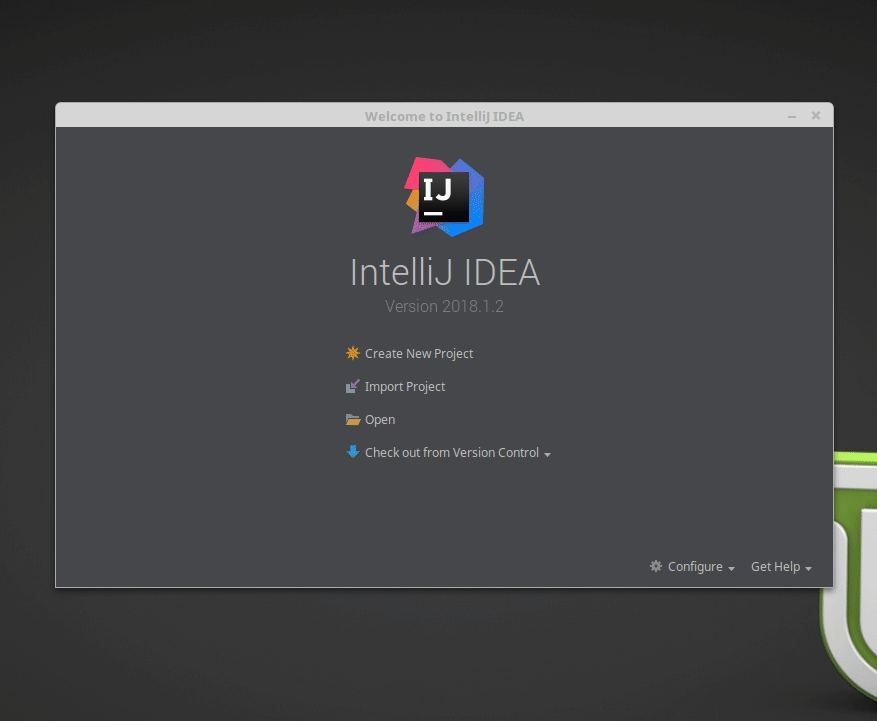
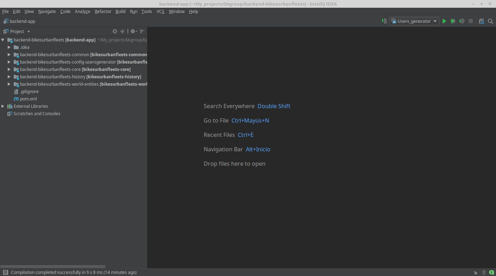

# Backend Setup - IntelliJ IDEA
## Instructions

### 1. Import the project
 - Open IntelliJ IDEA. 
 - Select Import Project.
 - The folder you should select is `/backend-bikesurbanfleets/`
 - Check this checkbox: `Search for projects recursively`, `Import Maven projects automatically` and `Create module groups for multi-module Maven Projects`
 
 

### 2. Run the project with IntelliJ
As you can see this project is separated in modules. 

The module `bikesurbanfleets-config-usergenerator` generates users, and the module `bikesurbanfleets-core` simulates. 
We should create two Run Configurations. One to generate users, and the other to simulate, to run our code with the IDE.

#### Users generator configuration 
- Click on `Run` &rarr; `Edit Configuration`.
- Select the button `+` &rarr; `Application` and name this Run Configuration as you want.
- Select in Main class the `Application.java` of the `backend-bikesurbanfleets-config-usersgenerator`
- Inside `Program arguments`, copy and paste the next arguments: [Users generator arguments](bikesurbanfleets-config-usergenerator_Args.md)
- Select on `Use classpath of module` the module: `bikesurbanfleets-config-usersgenerator`.
- Click `Apply`, then click `Ok`.  

#### Core configuration 
- Click on `Run` &rarr; `Edit Configuration`.
- Select the button `+` &rarr; `Application`.
- Select in Main class the `Application.java` of the `backend-bikesurbanfleets-core` and name this Run Configuration as you want.
- Inside `Program arguments`, copy and paste the next arguments: [Users generator arguments](bikesurbanfleets-core_Args.md)
- Select on `Use classpath of module` the module: `bikesurbanfleets-core`.
- Click `Apply`, then click `Ok`.  

